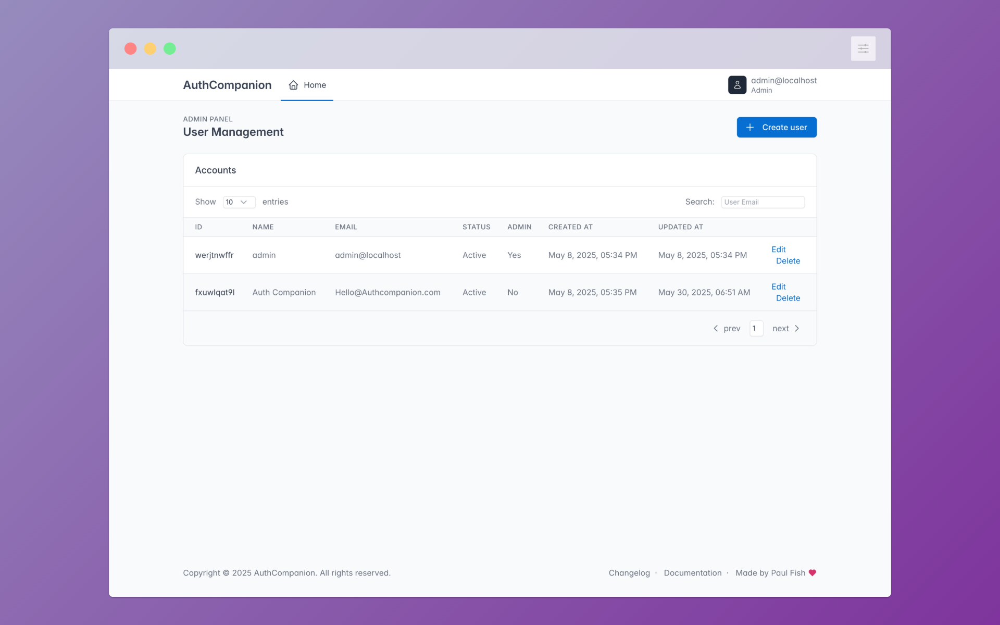

<p align="center">
  <a href="https://github.com/authcompanion/authcompanion2" rel="noopener">
 </a>
</p>

<h2 align="center"><b>AuthCompanion 2</b></h2>

<p align="center"> An admin-friendly, User Management Server (with Passkeys & JWTs) - for seamless and secure integration of user authentication.
</p>

<div align="center">

  <a href="">
     
   </a>
   <a href="https://github.com/authcompanion/authcompanion2/stargazers">
     
   </a>
   <a href="https://nodejs.org/en/">
     
   </a>
      <a href="https://github.com/authcompanion/authcompanion2/tags">
     
   </a>

</div>
<br />
<p align="center"> Useful Links:  <a href="https://docs.authcompanion.com/"> Documentation</a> | <a href="https://github.com/authcompanion/authcompanion2/blob/main/CHANGELOG.md"> CHANGELOG</a> | <a href="https://demo.authcompanion.com/login"> Demo Site</a> | <a rel="me" href="https://hachyderm.io/@paulfish"> Follow progress on Mastodon</a>
</p>

---

## Hot topics

- We've added full OpenAPI 3.0 specification integration. Access the interactive documentation at: http://localhost:3002/docs/api when running the AuthC Server. Also refresh all of the site documentation for better clarity and instruction.

## Introduction

AuthCompanion aims to satisfy the most common authentication and user management needs for your web application.

With AuthC you can:

- Securely handle the registration, login, logout, and account recovery of user accounts.
- Generate and verify [JWTs](https://jwt.io/introduction), a token used for your user's session and authenticating them into your web application's backend APIs.
- Manage users via a self-service Dashboard and confidently store and own your web application's user accounts, on premises.
- Help users create accounts and login with a passkey on their mobile device (aka passwordless) or by using traditional username/passwords instead.

|             Login Screen             |            Registration Screen             |
| :----------------------------------: | :----------------------------------------: |
|  |  |

## Try it

The instructions below will launch the default server for exploring the features.

### From Source

Pre-requirement:

- [Node.js](http://nodejs.org) **version >=22**

Clone the repo if you haven't done so, and install dependencies using this
command:

```bash
$ npm install
```

When you're ready, start the server with the default settings!

```bash
$ npm start
```

### With Docker

Start the server (with the default config):

```bash
$ docker run -it -p 3002:3002 --name AuthCompanion ghcr.io/authcompanion/authcompanion2:main
```

Also available is the [docker-compose.yml](https://github.com/authcompanion/authcompanion2/blob/main/docker-compose.yml)

### Configure AuthCompanion

If you're just trying AuthC out for the first time, the default configuration will work. See the [Configuration Guide](https://docs.authcompanion.com/guide/configuration.html) for a closer look at how to configure the server for other environments.

### Launch

When ready, read the [Launch Guide](https://docs.authcompanion.com/guide/launch.html) for more information on setting up AuthC in production.

---

## Features

- [x] **Web Forms for User Authentication:** Use pre-built and customizable web
      forms for your application users to: log in with their credentials,
      register an account, update their profile, and issue forgotten passwords.

- [x] **Admin Dashboard for Managing User Profiles:** Modify the profile
      information of your users via a self-service dashboard - all account information is stored in a SQLite
      database.

- [x] **User Account Recovery:** Restore a user's access to their account using
      the **Forgot Password** flow which sends a special link via email for
      helping users quickly recover their account.

- [x] **Passwordless Flow:** Streamline your user's Login and Registration with Passkey,
      and authenticate users with a mobile device, USB security key or computer.

- [x] **Extensible Platform:** AuthC supports a
      [plugin system](https://www.fastify.io/docs/latest/Reference/Plugins/) for
      easily adding new functionality to cover more of your authentication needs.

### Web Forms for Authentication

Authcompanion provides built-in web forms for user authentiation including both login and registration pages.

After a user authenticates with AuthC's web forms, we pass them to your web application.

For a full list of AuthC's Web Forms, see the [Web Form Guide](https://docs.authcompanion.com/guide/webforms.html).

---

## Admin Dashboard

The Admin Dashboard is a tool that allows administrators or application owners to manage the users of their web application. It provides a range of functions that administrators can use to create, edit, and delete user accounts; all via a friendly and intuitive interface.

Check out the Admin Dashboard in the documentation to learn how to access it: [Administer](https://docs.authcompanion.com/guide/administer.html).



---

## Explore

The best way to learn is by doing; here's a couple ways to get started.

You can either use the publicly available demo at [demo.authcompanion.com](https://demo.authcompanion.com/login) or start the server locally.

### 1. Create a user

AuthC comes with pre-built [Web Forms](#web-forms-for-authentication) to help
you quickly integrate user auth alongside your web application.

With the AuthC server running (in the prior steps), start first by registering an account using this
web form: http://localhost:3002/register

### 2. Login as the new user

Next, log in with the account you just created using your email and password at
this web form: http://localhost:3002/login. The server response includes
an access token for use when authenticating to backend APIs and redirects the user to your application's home page.

### 3. Login as the Administrator

Log into the Admin Dashboard using the credentials found via the [Administer Guide](https://docs.authcompanion.com/guide/administer.html) and update the user's profile you created in the previous step by changing their email (or similar field).

### 3. Read the Integration Guide

Have a look through the [Integration Guide](https://docs.authcompanion.com/guide/integrate.html) to understand how your frontend applications and backend web services interact with AuthC.

---

## API Docs

### Authentication API

The RESTful Authentication API powers the Web Forms by which users authenticate into your web app. It's important to note that the web forms alone doesn't cover every authentication flow for your users. For example: refreshing an expired access token would require interacting with AuthC's APIs in addition to using the Web Froms.

### Admin API

The Admin API helps an administrator to manage the users of their web application. It provides a range of functions through which administrators can programatially create, edit, and delete user accounts. The Admin API is also natively used by the Admin Dashboard.

- **Try the API:** Open http://localhost:3002/docs/api in your browser while the AuthC server is running.
- **Interactive Documentation:** The documentation UI allows you to try endpoints, inspect request/response schemas, and view detailed requirements.

---

## License

AuthCompanion is licensed under the
[Big Time Public License](https://bigtimelicense.com/versions/2.0.1). These
terms let you use and share this software for noncommercial purposes and in
small business for free, while also guaranteeing that paid licenses for big
businesses will be available on fair, reasonable, and nondiscriminatory terms.

## Contributions

Cheers for the logo design - Timothy Reeder
[(Github)](https://github.com/tokonoma)

Heavy lifting on the prototype and constant inspiration - Teddy Schmitz
[(Github)](https://github.com/Teddy-Schmitz)

---

Take AuthCompanion, the useful sidekick, into your next web project! 👏
