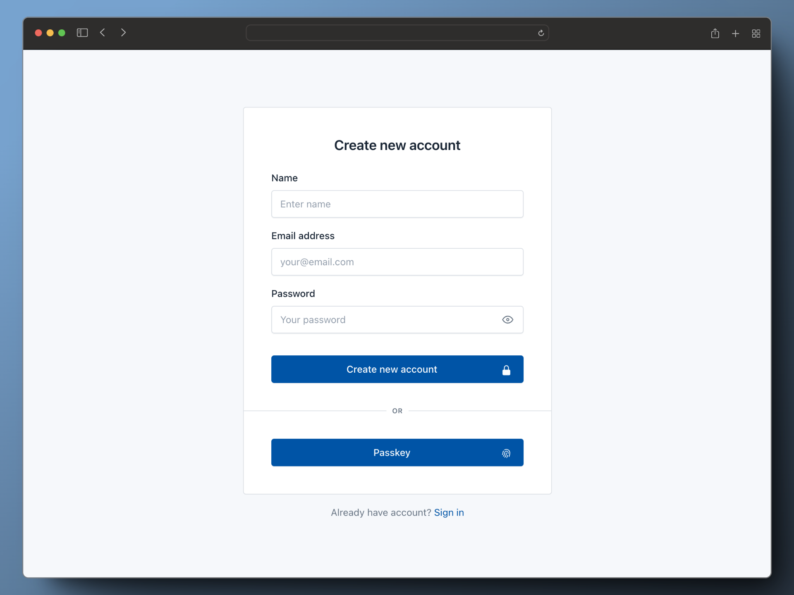

<p align="center">
  <a href="https://github.com/authcompanion/authcompanion2" rel="noopener">
 </a>
</p>

<h2 align="center"><b>AuthCompanion 2</b></h2>

<p align="center"> An effortless, token-based user management server - well suited for modern web projects.
</p>

<div align="center">

  <a href="">
     
   </a>
   <a href="https://github.com/authcompanion/authcompanion2/stargazers">
     
   </a>
   <a href="https://nodejs.org/en/">
     
   </a>
      <a href="https://github.com/authcompanion/authcompanion2/tags">
     
   </a>

</div>
<br />
<p align="center">  <a href="https://docs.authcompanion.com/"> Documentation</a> | <a href="https://github.com/authcompanion/authcompanion2/blob/main/CHANGELOG.md"> CHANGELOG</a> | <a href="https://demo.authcompanion.com/v1/web/login"> Demo Site</a> | <a rel="me" href="https://hachyderm.io/@paulfish"> Follow on Mastodon</a>
</p>

---

## Introduction

AuthCompanion aims to satisfy the most common authentication and user management needs for your web application.

With AuthC you can:

- Securely handle the registration, login, logout, and account recovery of user accounts.
- Generate and verify [JWTs](https://jwt.io/introduction), a token used for your user's session and authenticating them into your web application's backend APIs.
- Confidently store and own your web application's user accounts
- Help users create accounts and login with a passkey on their mobile device (aka passwordless) or by using traditional username/passwords instead

## Try it

The instructions below will launch the default server for exploration.

When ready, read the [Launch Guide](https://docs.authcompanion.com/guide/launch.html) for more information on setting up AuthC in production environments.

### With Docker

Make sure to have the
[respository cloned](https://docs.github.com/en/repositories/creating-and-managing-repositories/cloning-a-repository).
Then from the main directory, build the AuthC server image:

```bash
$ docker build -t authc_server .
```

Start the server (default config):

```bash
$ docker run --name authcompanion \
 -p 3002:3002 \
authc_server
```

### From Source

Pre-requirement:

- [Node.js](http://nodejs.org) **version 16+**

Clone the repo if you haven't done so, and install dependencies using this
command:

```bash
$ npm install
```

When you're ready, start the server with the default settings!

```bash
$ npm run start
```

### Configurations

If you're just trying AuthC out for the first time, the default configuration will work so you can poke around. See the [Configuration Guide](https://docs.authcompanion.com/guide/configuration.html) for a closer look at how to configure the server.

---

## Explore

The best way to learn is by doing; here's a couple ways to get started.

You can either use the publicly available demo at [demo.authcompanion.com](https://demo.authcompanion.com/v1/web/login) or start the server locally.

### 1. Create a user

AuthC comes with pre-built [Web Forms](#web-forms-for-authentication) to help
you quickly integrate user auth alongside your web application.

With the AuthC server running (in the prior steps), start first by registering an account using this
web form: http://localhost:3002/v1/web/register

### 2. Login as the new user

Next, log in with the account you just created using your email and password at
this web form: http://localhost:3002/v1/web/login. The server response includes
an access token for use when authenticating to backend APIs and redirects the user to your application's home page.

### 3. Read the Integration Guide

Have a look through the [Integration Guide](https://docs.authcompanion.com/guide/integrate.html) to understand how your frontend applications and backend web services interact with AuthC.

---

## Features

- [x] **Web Forms for User Authentication:** Use pre-built and customizable web
      forms for your application users to: log in with their credentials,
      register an account, update their profile, and issue forgotten passwords.

- [x] **Manage User Profiles and JWTs:** Update the password and profile
      information of your users - all account information is stored in a SQLite
      database. Easily manage the life-cycle of your user's JWT used for
      authentication.

- [x] **User Account Recovery:** Restore a user's access to their account using
      the **Forgot Password** flow which sends a special link via email for
      helping users quickly recover their account.

- [x] **Passwordless Flow:** Streamline your user's Login and Registration with Passkey,
      and drop asking users username/password.

- [x] **Extensible Platform:** AuthC supports a
      [plugin system](https://www.fastify.io/docs/latest/Reference/Plugins/) for
      easily adding new functionality to cover more of your authentication needs.

### Web Forms for Authentication

Authcompanion provides built-in web forms for user authentiation.

The web forms use CSS-in-JS - making them easily customizable for
your specific branding and authentication needs. No build step required to make
changes to the Web Form's look and feel.

|             Login Screen             |            Registration Screen             |
| :----------------------------------: | :----------------------------------------: |
|  |  |
|  http://localhost:3002/v1/web/login  |   http://localhost:3002/v1/web/register    |

After a user authenticates with AuthC's web forms, we pass them to your web application.

For a full list of AuthC's Web Forms, see the [Web Form Guide](https://docs.authcompanion.com/guide/webforms.html).

---

## Authentication API Docs

The RESTful Authentication API powers the Web Forms by which users authenticate into your web app. It's important to note that the web forms alone doesn't cover every auth flow for your users. For example: validating the magic URL in the forgot password flow or refreshing an expired access token would require interacting with AuthC's APIs.

Using both the Auth API and Web Forms you can easily integrate and cover your auth use cases. For more information about the Authentication API check out the docs here: [https://docs.authcompanion.com/guide/authapi.html](https://docs.authcompanion.com/guide/authapi.html)

---

## License

AuthCompanion is licensed under the
[Big Time Public License](https://bigtimelicense.com/versions/2.0.1). These
terms let you use and share this software for noncommercial purposes and in
small business for free, while also guaranteeing that paid licenses for big
businesses will be available on fair, reasonable, and nondiscriminatory terms.

## Contributions

Cheers for the logo design - Timothy Reeder
[(Github)](https://github.com/tokonoma)

Heavy lifting on the prototype and constant inspiration - Teddy Schmitz
[(Github)](https://github.com/Teddy-Schmitz)

---

Take AuthCompanion, the useful sidekick, into your next web project! 👏
